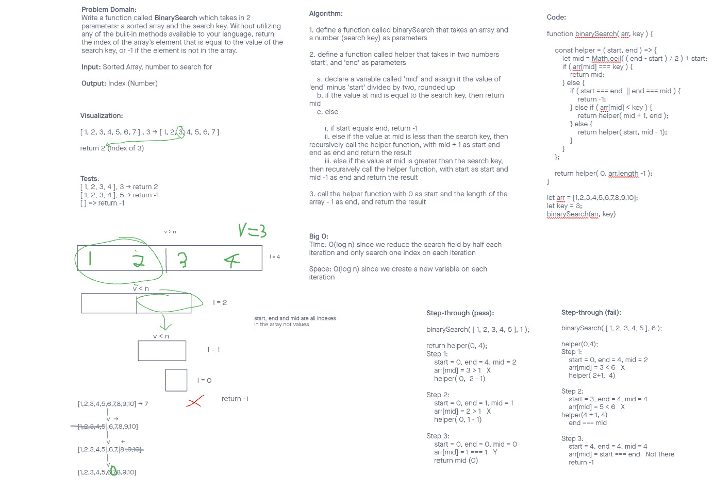

# challenge class 03 binarySearch

Problem Domain:

Write a function called BinarySearch which takes in 2 parameters: a sorted array and the search key. Without utilizing any of the built-in methods available to your language, return the index of the array’s element that is equal to the value of the search key, or -1 if the element is not in the array.

# binarySearch

Write a function called BinarySearch which takes in 2 parameters: a sorted array and the search key. Without utilizing any of the built-in methods available to your language, return the index of the array’s element that is equal to the value of the search key, or -1 if the element is not in the array.

## Whiteboard Process

## Approach & Efficiency

Algorithm:

1. define a function called binarySearch that takes an array and a number (search key) as parameters

2. define a function called helper that takes in two numbers 'start', and 'end' as parameters

 a. declare a variable called 'mid' and assign it the value of 'end' minus 'start' divided by two, rounded up

 b. if the value at mid is equal to the search key, then return mid

 c. else

  i. if start equals end, return -1

  ii. else if the value at mid is less than the search key, then recursively call the helper function, with mid + 1 as start and end as end and return the result

  iii. else if the value at mid is greater than the search key, then recursively call the helper function, with start as start and mid -1 as end and return the result

3. call the helper function with 0 as start and the length of the array - 1 as end, and return the result
