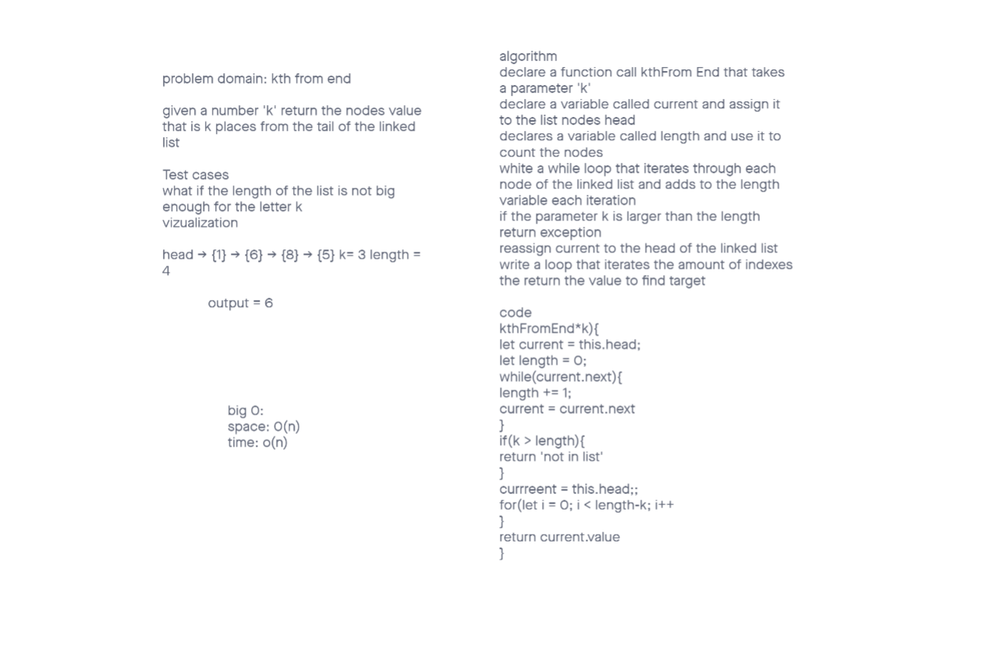

# challenge class 07 kthFromEnd

## Problem Domain:

given a number 'k' return the nodes value that is k places from the tail of the linked list

## Whiteboard Process

## Approach & Efficiency

declare a function call kthFrom End that takes a parameter 'k'

declare a variable called current and assign it to the list nodes head

declares a variable called length and use it to count the nodes

white a while loop that iterates through each node of the linked list and adds to the length variable each iteration

if the parameter k is larger than the length return exception

reassign current to the head of the linked list

write a loop that iterates the amount of indexes the return the value to find target
