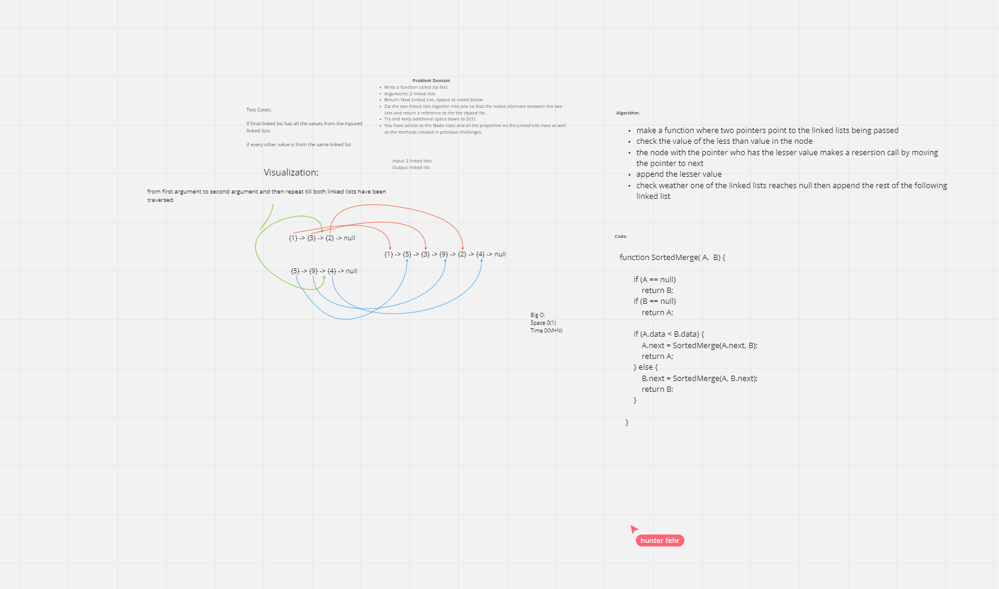

# challenge class 08 linked list zipped

Problem Domain:

Write a function called zip lists
Arguments: 2 linked lists
Return: New Linked List, zipped as noted below
Zip the two linked lists together into one so that the nodes alternate between the two lists and return a reference to the the zipped list.
Try and keep additional space down to O(1)
You have access to the Node class and all the properties on the Linked List class as well as the methods created in previous challenges.

## binarySearch

make a function where two pointers point to the linked lists being passed
check the value of the less than value in the node
the node with the pointer who has the lesser value makes a resersion call by moving the pointer to next
append the lesser value
check weather one of the linked lists reaches null then append the rest of the following linked list

## Whiteboard Process

## Approach & Efficiency

make a function where two pointers point to the linked lists being passed
check the value of the less than value in the node
the node with the pointer who has the lesser value makes a resersion call by moving the pointer to next
append the lesser value
check weather one of the linked lists reaches null then append the rest of the following linked list

## Big O

Space: O(m+n)
time: O(1)
