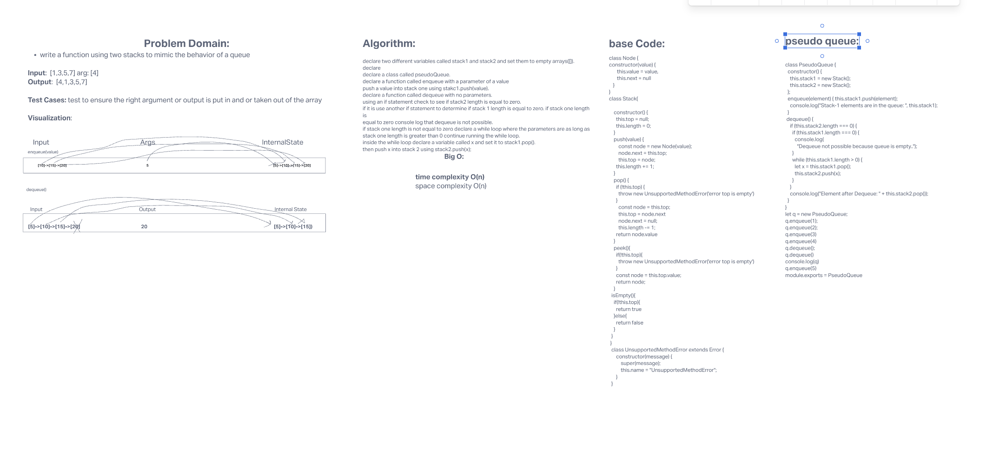

# challenge class 07 kthFromEnd

## Problem Domain

recreate teh behavior of a queue using two stacks

## Whiteboard Process

## Approach & Efficiency

declare two different variables called stack1 and stack2 and set them to empty arrays([]).

declare

declare a class called pseudoQueue.

declare a function called enqueue with a parameter of a value

push a value into stack one using stakc1.push(value).

declare a function called dequeue with no parameters.

using an if statement check to see if stack2 length is equal to zero.

if it is use another if statement to determine if stack 1 length is equal to zero. if stack one length is

equal to zero console log that dequeue is not possible.

if stack one length is not equal to zero declare a while loop where the parameters are as long as stack one length is greater than 0 continue running the while loop.

inside the while loop declare a variable called x and set it to stack1.pop().

then push x into stack 2 using stack2.push(x);
