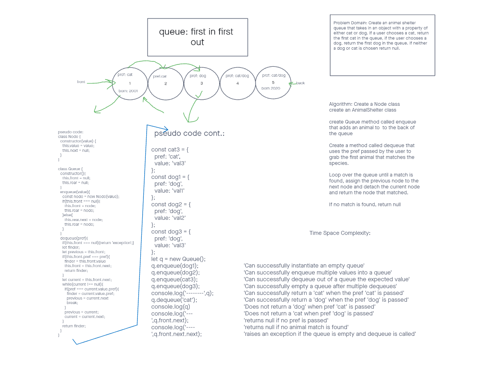

# challenge class 12 AnimalQueue

## Problem Domain

Problem Domain: Create an animal shelter queue that takes in an object with a property of either cat or dog. If a user chooses a cat, return the first cat in the queue, if the user chooses a dog, return the first dog in the queue. If neither a dog or cat is chosen return null.

## Whiteboard Process

## Approach & Efficiency

Algorithm: Create a Node class

create an AnimalShelter class

create Queue method called enqueue that adds an animal to  to the back of the queue

Create a method called dequeue that uses the pref passed by the user to grab the first animal that matches the species.

Loop over the queue until a match is found, assign the previous node to the next node and detach the current node and return the node that matched.

If no match is found, return null
