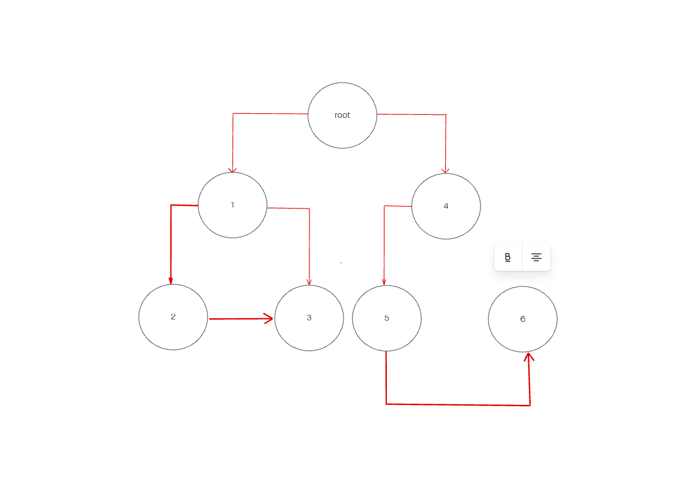

# challenge class 15 binary tree

## Problem Domain

using what you learned on rfriday create a basic tree class and a binary tree class containing the pre, post, and in order traversing functions additionally create a contains function that will determine if a tree contains a preset value using a boolean.

## Whiteboard Process

## Approach & Efficiency

Algorithm: Create a Node class

create a Tree Class

create a BinaryTree class

create tree method called postOrder using a parameter of value

create tree method called postOrder using a parameter of value

create tree method called postOrder using a parameter of value

create a mothd called contians that determines if there is a value found in a binary tree.
