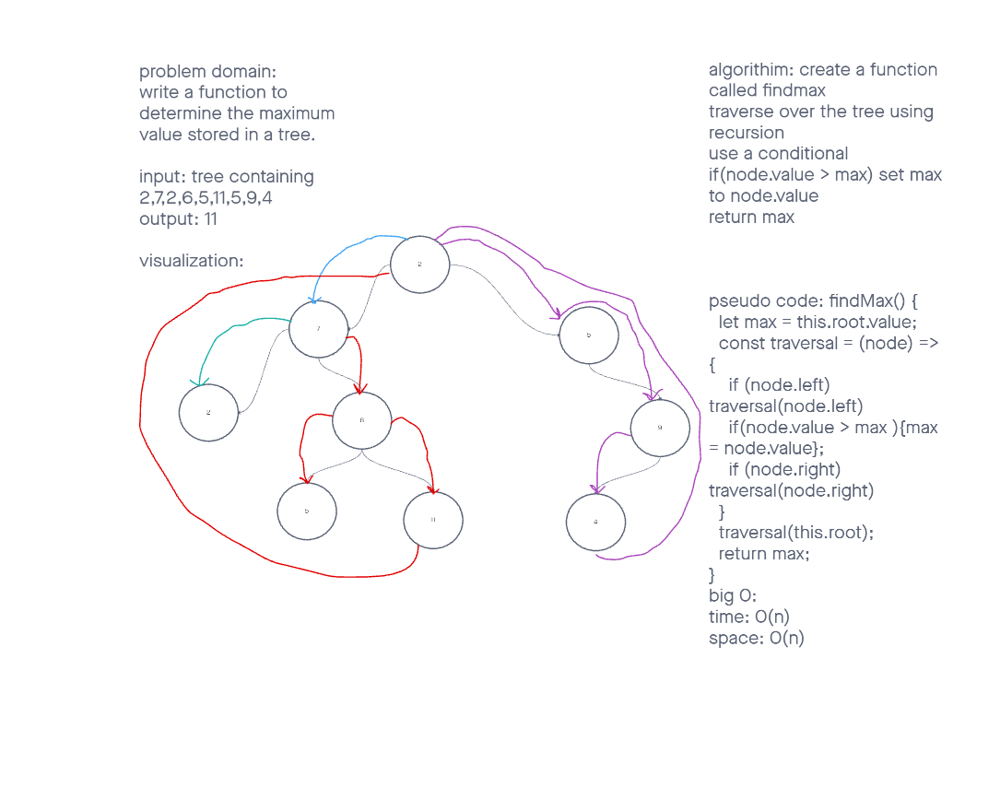

# challenge class 16 binary tree maximum value

## Problem Domain

create a funciton to determine the maximum value in a given binary tree.

## Whiteboard Process

## Approach & Efficiency

Algorithm: Create a Node class

create a Tree Class

create a BinaryTree class

create tree method called postOrder using a parameter of value

create tree method called postOrder using a parameter of value

create tree method called postOrder using a parameter of value

create a method called findMax  that has no parmeters and traverses over the tree to determine the max value.

create a mothd called contians that determines if there is a value found in a binary tree.
