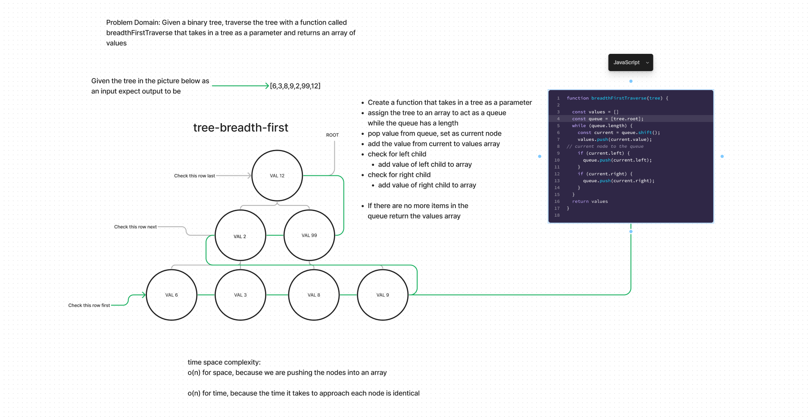

# challenge class 17 binary tree breadth first traversal

## Problem Domain

Given a binary tree, traverse the tree with a function called
breadthFirstTraverse that takes in a tree as a parameter and returns an array of
values

## Whiteboard Process

## Approach & Efficiency

Create a function that takes in a tree as a parameter

assign the tree to an array to act as a queue

while the queue has a length

pop value from queue, set as current node

add the value from current to values array

check for left child

add value of left child to array

check for right child

add value of right child to array

If there are no more items in the

queue return the values array
