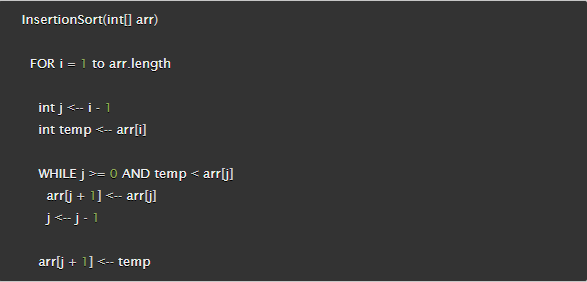

# A brief Introduction to Insertion Sort. Answering the Question. Why?

## Introduction to Insertion Sort

Insertion Sort is a sorting algorithm that can be employed to arrange an array of elements in either an ascending or descending order. It achieves this by iterating through the array and positioning each element into its proper location among the sorted elements to its left. The algorithm operates by commencing at the beginning of the array and comparing each element to the ones to its left, inserting it into the appropriate position among them. This procedure is repeated until all elements in the array are in their proper locations, resulting in a sorted array.

## Pseudo-code Implementation

This pseudo code is an example of the insertion sort algorithm:

;

the process happens in these following steps:

1. Initialize a looping construct, such as a 'for' loop.

2. Within the loop, initialize a variable 'i' and set its value to zero. Compare that 'i' is less than the length of the array by evaluating the expression 'i < arr.length'.

3. Increment the value of 'i' for each iteration of the loop.

4. Inside the loop, initialize another variable 'j' and assign it the value of 'i' minus one.

5. Initialize a third variable 'temp' and assign it the value of the element at the index position of 'i' in the array.

6. Create a conditional looping construct, such as a 'while' loop, where the condition being evaluated is that 'j' is less than or equal to zero and 'temp' is less than the
   element at the index position of 'j' in the array.
   Within the loop, reassign the value of the element at the index position of 'j' plus one in the array to the value of the element at the index position of 'j'.

7. Reassign the value of 'j' to itself minus one.

8. Lastly, assign the value of 'temp' to the element at the index position of 'j' plus one in the array.

## USEFUL IN INTERVIEWS?

Insertion sort is a simple yet effective algorithm that can be utilized to arrange a series of elements in either an ascending or descending order. However, its practicality in the realm of technical interviews is debatable due to its suboptimal time and space complexity when compared to other algorithms. While it may be expeditious to implement, its efficacy in terms of sorting larger datasets leaves much to be desired. Therefore, it may not be the most practical algorithm to utilize or practice in a technical setting in order to assess a candidate's technical skills and knowledge. It is generally more advisable to utilize or practice algorithms that have superior performance capabilities, particularly when it comes to handling larger datasets.

## Time Complexity.

It has been previously mentioned that the Insertion Sort algorithm is not particularly conducive to use in technical interviews due to its subpar Space Time complexity, also known as its big O notation. The big O of Insertion Sort is O(n^2), which signifies that the time necessary for the algorithm to complete increases at a rate of n^2, where n is representative of the size of the array. This attribute renders Insertion Sort inefficient, particularly when dealing with expansive datasets, as the time required to complete the sorting process can become unwieldy.

## Real world Applications

As a web developer, it may be practical to utilize the Insertion Sort algorithm in situations where the necessity to sort a small array presents itself and the efficiency of time is not a paramount concern. An example of this scenario would be if there is a list comprising several hundred items that necessitate sorting, in which case utilizing Insertion Sort could be a viable option. However, if confronted with the task of sorting a list comprising several million items, it would generally be more advisable to choose a faster algorithm due to its superior efficiency in such a case.

## Conclusion

Although the Insertion Sort algorithm is relatively simple to implement, its inferior time and space complexity make it generally inapplicable in a real-world setting and impractical to use in a technical interview. However, I believe there is value in learning how and why it works, even if it is not frequently used in practice. This understanding can provide insight into different methods for traversing arrays or data structures and increase one's overall comprehension of algorithm design and functionality. While it may not be a frequently utilized algorithm, I believe that all algorithms and code have their place in the industry and one can never predict when or where they may be useful. Therefore, I believe it is important to be familiar with a wide range of algorithms and their underlying principles, regardless of their practicality in certain situations.
