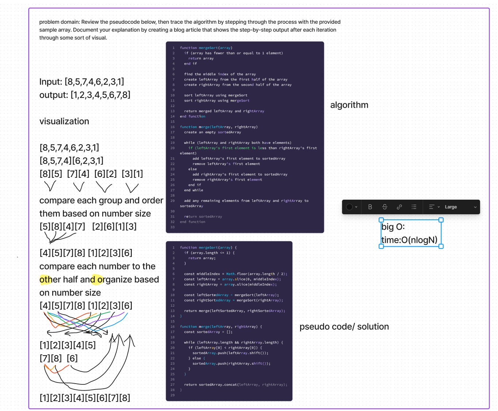

# Challenge Summary

Review the pseudocode below, then trace the algorithm by stepping through the process with the provided sample array. Document your explanation by creating a blog article that shows the step-by-step output after each iteration through some sort of visual.

## Whiteboard Process / approach and efficiency

;

## Solution

```
function mergeSort(array) {
  if (array.length <= 1) {
    return array;
  }

  const middleIndex = Math.floor(array.length / 2);
  const leftArray = array.slice(0, middleIndex);
  const rightArray = array.slice(middleIndex);

  const leftSortedArray = mergeSort(leftArray);
  const rightSortedArray = mergeSort(rightArray);

  return merge(leftSortedArray, rightSortedArray);
}

function merge(leftArray, rightArray) {
  const sortedArray = [];

  while (leftArray.length && rightArray.length) {
    if (leftArray[0] < rightArray[0]) {
      sortedArray.push(leftArray.shift());
    } else {
      sortedArray.push(rightArray.shift());
    }
  }

  return sortedArray.concat(leftArray, rightArray);
}
```
