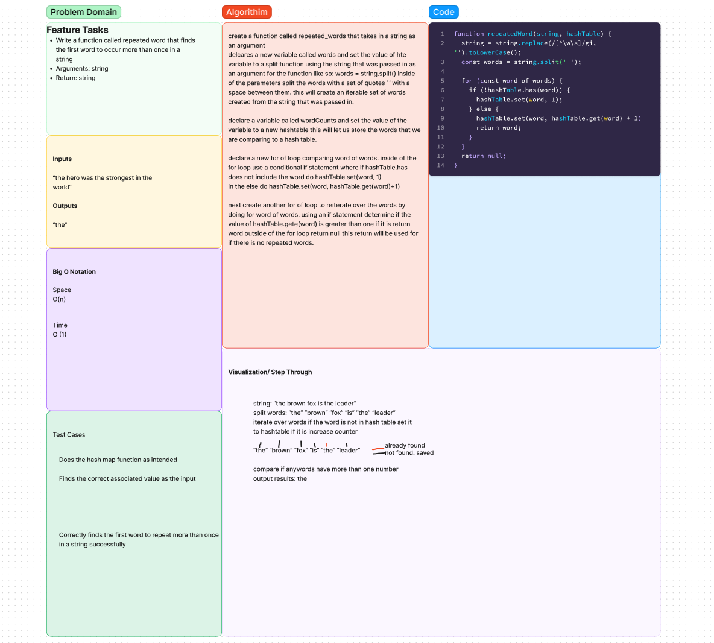

# challenge class 31 Repeated words fn using a hash table

## Problem Domain

Write a function called repeated word that finds the first word to occur more than once in a string

## Whiteboard Process

## Approach & Efficiency

create a function called repeated_words that takes in a string as an argument
declare a new variable called words and set the value of hte variable to a split function using the string that was passed in as an argument for the function like so: words = string.split() inside of the parameters split the words with a set of quotes ‘ ’ with a space between them. this will create an iterable set of words created from the string that was passed in.

declare a variable called wordCounts and set the value of the variable to a new hashTable this will let us store the words that we are comparing to a hash table.

declare a new for of loop comparing word of words. inside of the for loop use a conditional if statement where if hashTable.has does not include the word do hashTable.set(word, 1)
in the else do hashTable.set(word, hashTable.get(word)+1)

next create another for of loop to reiterate over the words by doing for word of words. using an if statement determine if the value of hashTable.get(word) is greater than one if it is return word outside of the for loop return null this return will be used for if there is no repeated words.
